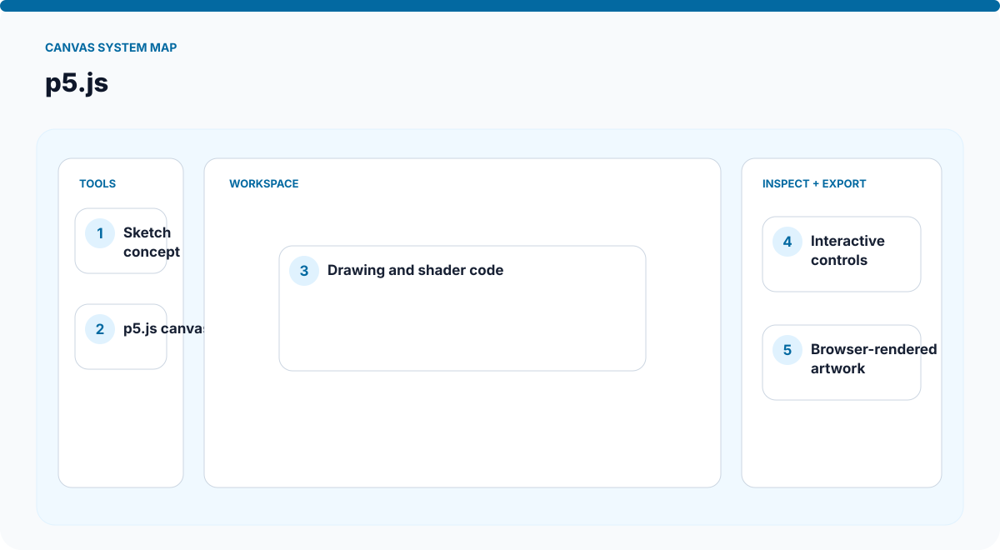
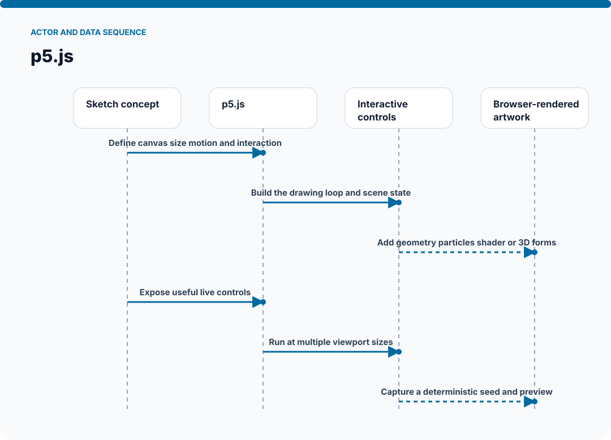
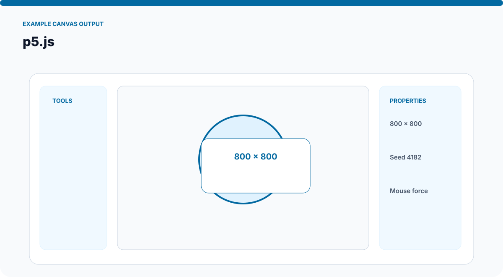
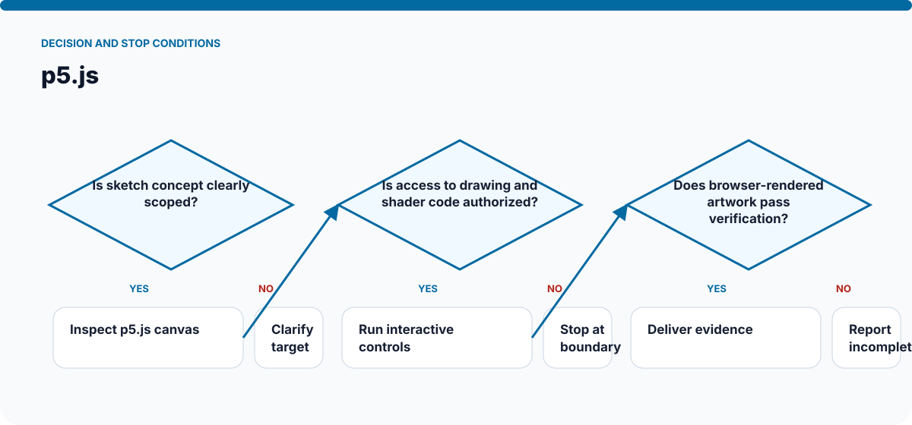

# How p5.js Works

The visuals on this page are static SVGs, so they render directly on GitHub on phones and desktop browsers. Each one is generated from a model specific to this skill.

## System architecture

### Components

- **1. Sketch concept:** participates in define canvas size motion and interaction.
- **2. p5.js canvas:** participates in build the drawing loop and scene state.
- **3. Drawing and shader code:** participates in add geometry particles shader or 3d forms.
- **4. Interactive controls:** participates in expose useful live controls.
- **5. Browser-rendered artwork:** participates in run at multiple viewport sizes.

## Actor and data sequence

### 1. Define canvas size motion and interaction

**Primary surface:** `Sketch concept`

Record the concrete input, the operation performed, and the evidence produced at this stage. Continue only when the output is sufficient for the next stage; otherwise preserve the blocker and stop.
### 2. Build the drawing loop and scene state

**Primary surface:** `p5.js canvas`

Record the concrete input, the operation performed, and the evidence produced at this stage. Continue only when the output is sufficient for the next stage; otherwise preserve the blocker and stop.
### 3. Add geometry particles shader or 3D forms

**Primary surface:** `Drawing and shader code`

Record the concrete input, the operation performed, and the evidence produced at this stage. Continue only when the output is sufficient for the next stage; otherwise preserve the blocker and stop.
### 4. Expose useful live controls

**Primary surface:** `Interactive controls`

Record the concrete input, the operation performed, and the evidence produced at this stage. Continue only when the output is sufficient for the next stage; otherwise preserve the blocker and stop.
### 5. Run at multiple viewport sizes

**Primary surface:** `Browser-rendered artwork`

Record the concrete input, the operation performed, and the evidence produced at this stage. Continue only when the output is sufficient for the next stage; otherwise preserve the blocker and stop.
### 6. Capture a deterministic seed and preview

**Primary surface:** `Sketch concept`

Record the concrete input, the operation performed, and the evidence produced at this stage. Continue only when the output is sufficient for the next stage; otherwise preserve the blocker and stop.

## Example output shape

The example is a visual contract: a real run may look different, but it should expose comparable state, provenance, and verification information. It is not presented as evidence of a live external action.

## Decision and stop conditions

The workflow stops when the target is ambiguous, the relevant surface is unavailable or unauthorized, or the final artifact cannot be checked. A logged-in session or successful tool call is not by itself proof that the requested outcome is complete.

## Verification checklist

- Confirm every component shown in the system map exists in the target environment.
- Trace the actor sequence using actual tool output or artifact state.
- Compare the result with the example-output information contract.
- Re-read or reopen the final artifact instead of trusting an attempt message.
- Report omitted stages, unsupported capabilities, and remaining human decisions.
